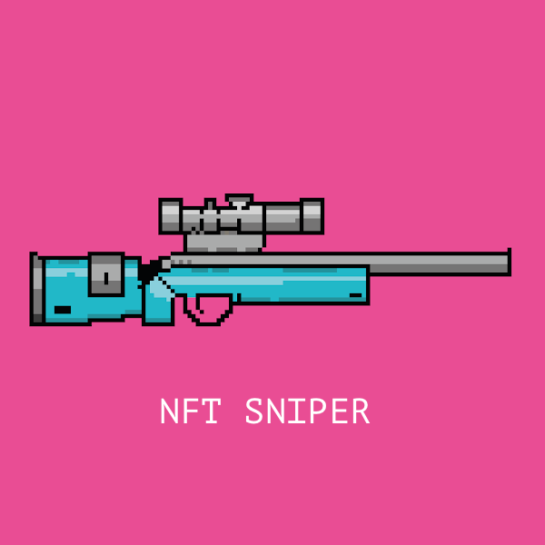

## NFT sniper

"NFT sniper" is a decentralized application for monitoring activity of nft whales and sweep the floor of projects in which whales are interested.



Just run the development server:

```bash
npm run dev
# or
yarn dev
```

Open [http://localhost:3000](http://localhost:3000) with your browser to see the result.

Then login with your metamask wallet, follow nft whales and wait for signals.
